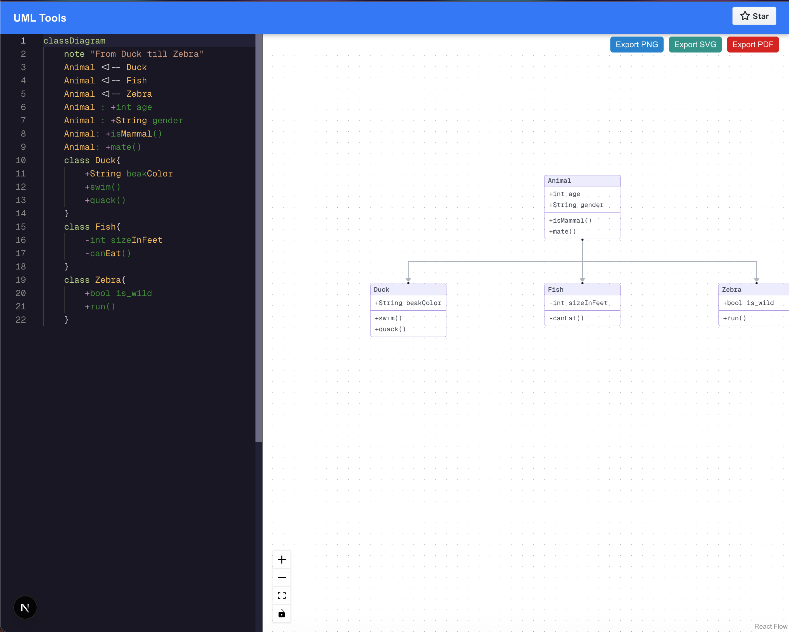

# UML-Tools

**UML-Tools** is an online tool that allow users to visualize `mermaidjs` [class diagram](https://mermaid.js.org/syntax/classDiagram.html). It uses [reactflow](https://reactflow.dev/) to render the image and `dagre` to provide additonal spacing functionalities.



## UML-Tools vs Mermaid Visualizers

I constantly run into challenges when visualizing `UML` diagrams generated with mermaidjs. These include;

- When dealing with complex diagrams the lines (edges) can become a giant pile of mess pretty fast with multiple lines crossing paths
- Inability to drag each component apart to have a better view. `Mermaid Live` provide zoom functionality but that zooms the whole diagram not individual classes
- Generated diagrams are not visually appealing. I get, it's "functionality over aesthetics", but why can't we have both?

## Features

- Visually appealing uml diagrams
- Draggable elements
- Zoom in/out functionalities
- Export functionality (to `png`, `svg` and `pdf`)
- Syntax highlighting and code completion

## Dev

This is a [Next.js](https://nextjs.org) project bootstrapped with [`create-next-app`](https://nextjs.org/docs/app/api-reference/cli/create-next-app).

First, clone the repositoru and then run the development server:

```bash
npm install
npm run dev
```

## Built with

- [Reactflow](https://reactflow.dev/)
- [MonacoEditor](https://www.npmjs.com/package/@monaco-editor/react)
- [Nextjs](https://nextjs.org/)
- [Dagre](https://github.com/dagrejs/dagre)
